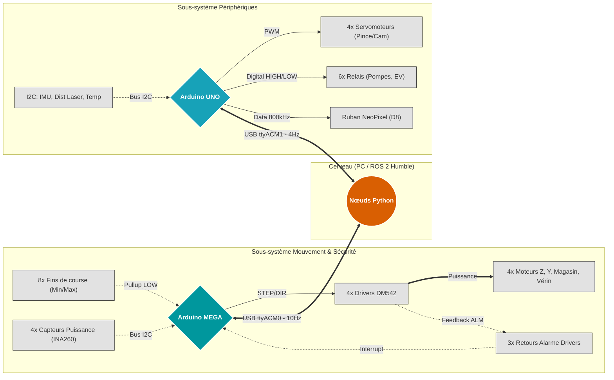
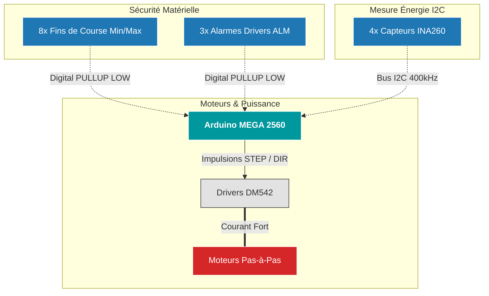
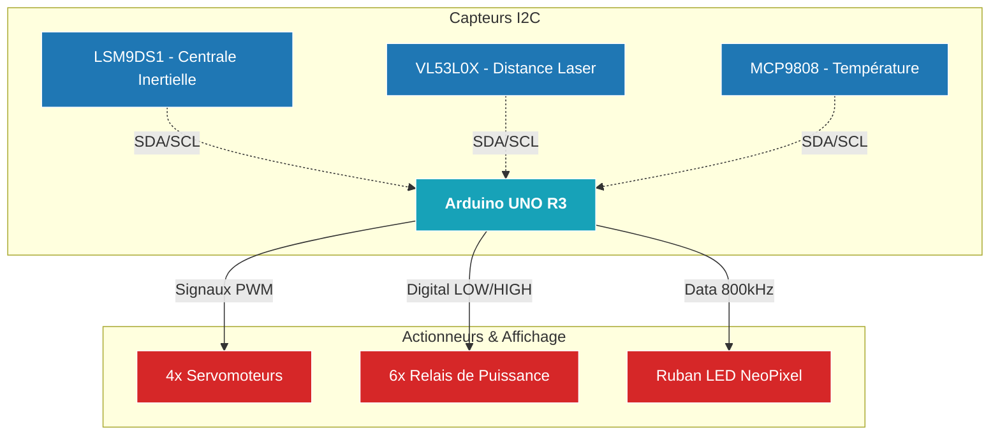
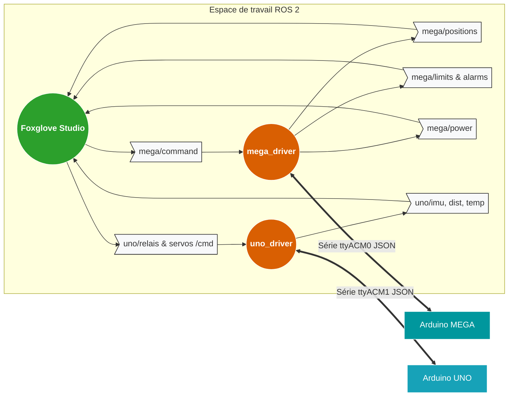

# 🤖 Firmware Embarqué - Robot SRS

Ce dépôt contient le code source bas niveau (C++) pour les microcontrôleurs du robot SRS. Le système est divisé en deux cartes distinctes pour garantir la sécurité matérielle, la séparation des flux de puissance, et la gestion des périphériques.

## 🏗️ Architecture du Système

Le code communique avec un ordinateur central (Raspberry Pi / PC sous ROS 2) via un protocole série JSON non-bloquant à 115200 bauds.


### Détail Matériel : Arduino MEGA (Nœud `001UC`)
Gère exclusivement les organes de puissance et la sécurité critique (hard-stop).


### 2. Zoom Matériel : Arduino UNO (Périphériques)
### Détail Matériel : Arduino UNO (Nœud `002UC`)
Gère l'interface avec l'environnement (capteurs, vision, préhension).


### 3. Graphe ROS 2 (Flux Logiciel)f
### Architecture Logicielle : Flux ROS 2
Ce graphe illustre comment le package `dual_serial_bridge` distribue les données entre le matériel et l'interface utilisateur.



## 📖 Dictionnaire d'API (Communication JSON)

L'entièreté de la communication entre ROS 2 et les Arduinos se fait via des chaînes JSON terminées par un retour à la ligne (`\n`).

### 1. Arduino MEGA (Mouvement & Sécurité)

**Télémétrie sortante (MEGA -> ROS 2) :**
* **Positions (10Hz) :** `{"src":"mega","pos":[Z, Magasin, Y, Verin]}`
* **Sécurité (10Hz) :** `{"src":"mega","mr":[0,1,0,0,0,0,0,0],"alm":[0,0,0,0]}` *(1 = Capteur touché ou Alarme activée)*
* **Puissance (2Hz) :** `{"src":"mega","pwr":[V1,I1,P1, V2,I2,P2, V3,I3,P3, V4,I4,P4]}`

**Commandes entrantes (ROS 2 -> MEGA) :**
* **Déplacer un axe :** `{"cmd":"move", "axis":1, "steps":200, "speed":1500.0}`
* **Arrêt d'urgence :** `{"cmd":"stop"}`
* **Reset Zéro (Software) :** `{"cmd":"home", "axis":0}` *(axis: 0 = tous, 1 à 4 = spécifique)*

### 2. Arduino UNO (Périphériques)

**Télémétrie sortante (UNO -> ROS 2) :**
* **Capteurs I2C (4Hz) :** `{"src":"uno", "imu_ok":1, "mcp_ok":1, "tof_ok":1, "temp_c":24.5, "dist_mm":150, "ax":0.0, "ay":0.0, "az":9.8, "gx":0.0, "gy":0.0, "gz":0.0, "mx":0.0, "my":0.0, "mz":0.0}`

**Commandes entrantes (ROS 2 -> UNO) :**
* **Contrôle Servomoteur :** `{"cmd":"servo", "id":1, "angle":90}` *(id: 1=CamZ, 2=CamY, 3=PinceRot, 4=PinceSerrage)*
* **Contrôle Relais :** `{"cmd":"relay", "id":1, "state":1}` *(id: 1=LedBlanche, 2=LedRGB, 3=Aspirateur, 4..6=EV)*
* **Contrôle Ruban LED (Fixe) :** `{"cmd":"led", "r":255, "g":0, "b":0, "a":255}` *(a = luminosité)*
* **Animation LED SRS :** `{"cmd":"led_effect", "state":1}`

---

## 🚀 Installation et Lancement

### 1. Flasher les Arduinos
1. Ouvrir le projet dans l'Arduino IDE.
2. Installer les bibliothèques requises : `ArduinoJson`, `AccelStepper`, `Adafruit INA260`, `Adafruit LSM9DS1`, `Adafruit MCP9808`, `Adafruit NeoPixel`, `VL53L0X`.
3. Téléverser dans les cartes respectives.

### 2. Lancer les Nœuds ROS 2
Une fois les cartes flashées et branchées en USB au PC/Raspberry, sourcez votre espace de travail ROS 2 et lancez les drivers Python du package `dual_serial_bridge` :

```bash
# Terminal 1 : Lancer le driver Mega
ros2 run dual_serial_bridge mega_driver

# Terminal 2 : Lancer le driver Uno
ros2 run dual_serial_bridge uno_driver
```